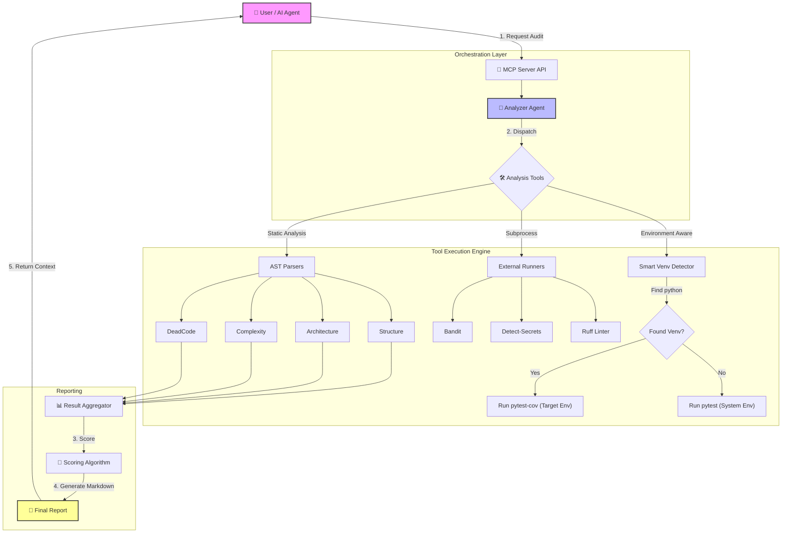

# ProjectAuditAgent 🕵️‍♂️

[](https://www.python.org/downloads/)
[](https://fastapi.tiangolo.com/)
[](https://modelcontextprotocol.io/)

**Production-ready Model Context Protocol (MCP) server for deep Python/FastAPI project analysis.**

ProjectAuditAgent performs AST-based code analysis to detect duplicates, dead code, efficiency issues, and security risks, generating actionable markdown reports with **realistic scores** and **comprehensive insights**.

---

## 🚀 Features

### **12 Extensible Analysis Tools**
| Tool | Description |
|------|-------------|
| **📁 Structure** | Directory tree visualization and file statistics |
| **🏗️ Architecture** | Mermaid dependency graphs with subgraph grouping |
| **🎭 Duplication** | 6-line block hashing to detect code duplication |
| **☠️ Dead Code** | Unused functions, classes, and imports (Vulture) |
| **⚡ Efficiency** | Cyclomatic complexity analysis (Radon) |
| **🧹 Cleanup** | Cache/temp files detection with size tracking |
| **🔒 Bandit** | Security vulnerability scanning |
| **🔑 Secrets** | Credential detection using `detect-secrets` |
| **📋 Ruff** | Fast Python linter for code quality |
| **🔍 Pip-Audit** | Dependency vulnerability checking |
| **✅ Tests** | Coverage analysis with Unit/Integration/E2E breakdown |
| **📝 Git** | Recent changes, commit tracking & branch status |

### **Production Capabilities**
* **✨ Agentic Dependency Installation:** AI automatically detects missing tools and asks user permission to install
* **📊 Realistic Scoring Algorithm:** Exponential penalties for low coverage (9% = -40 points, not -10!)  
* **📋 Tool Execution Summary:** Comprehensive table showing status of all 12 tools at a glance
* **🧪 Test Type Detection:** Automatically categorizes tests as Unit, Integration, or E2E
* **🔄 Recent Changes Tracking:** Shows last commit, author, time, and uncommitted changes
* **⏱️ Timeout Protection:** All subprocess calls protected with timeouts to prevent hangs
* **🎯 Smart Filtering:** Automatically excludes `.venv`, `node_modules`, and build artifacts
* **🔗 Pako Compression:** Mermaid graphs compressed for reliable link generation
* **🛡️ Auto-Fix with Safety:** Git dirty check prevents mixing uncommitted changes
* **🔒 100% Local:** No code leaves your machine

---

## 🧠 Architecture Flow



---

## 📦 Installation & Setup

### 1. Environment Setup
```bash
# Clone and enter repo
git clone https://github.com/Amitro123/mcp-python-auditor.git
cd mcp-python-auditor

# Create venv
python -m venv .venv
source .venv/bin/activate  # Windows: .venv\Scripts\activate

# Install dependencies
pip install -r requirements.txt
```

### 2. Install Analysis Tools
```bash
# Required for full functionality
pip install bandit detect-secrets vulture radon ruff pip-audit pytest pytest-cov

# Or let the AI install them for you! (Agentic flow)
# Just run the server and it will detect missing tools automatically
```

### 3. Verify Installation
```bash
# Run the verification script
python verify_tools.py

# Should show: ✅ All tools are properly installed!
```

### 4. Run the MCP Server
You have two entry points depending on your needs:

**Option A: FastMCP (Recommended for Claude Desktop/Cursor)**
```bash
python mcp_fastmcp_server.py
# Or with fastmcp CLI:
fastmcp dev mcp_fastmcp_server.py
```

**Option B: FastAPI Server (For API usage)**
```bash
uvicorn app.main:app --reload
```

---

## 🔌 MCP Configuration (Claude/Cursor)

To use this tool with Claude Desktop or Cursor, add the following to your config file:

**File:** `claude_desktop_config.json`  
**Location:**
- **Mac:** `~/Library/Application Support/Claude/`
- **Windows:** `%APPDATA%\Claude\`

```json
{
  "mcpServers": {
    "project-audit": {
      "command": "python",
      "args": ["C:\\absolute\\path\\to\\mcp-python-auditor\\mcp_fastmcp_server.py"]
    }
  }
}
```

> **Note:** Use absolute paths and double backslashes (`\\`) on Windows.

**📖 For detailed MCP setup guide, see:** [docs/MCP_USER_GUIDE.md](docs/MCP_USER_GUIDE.md)

---

## 🎯 Usage Examples

Once connected to Claude, you can use natural language to trigger tools.

### 1. Full Audit
```
"Run a full audit on C:/Projects/MyApp and generate a report."
```

**What it does:**
- Runs all 12 analysis tools in parallel
- Generates a scored report (0-100)
- Saves to `reports/FULL_AUDIT_<id>.md`
- Returns markdown content to AI

### 2. Missing Dependencies? No Problem!
```
AI: "I need to run an audit but tools are missing. Would you like me to install them?"
You: "Yes, install them"
AI: [Calls install_dependencies tool]
AI: "✅ Installation successful! Running audit now..."
```

### 3. Architecture Review
```
"Analyze the project architecture and show me the dependency graph."
```

**What it does:**
- Parses Python imports using AST
- Groups modules into subgraphs by directory
- Generates Mermaid diagram with compressed link

### 4. Auto-Fix (Safe Code Cleanup)
```
"Run auto-fix with confirm=True."
```

**What it does:**
1. ✅ Checks for uncommitted changes (aborts if dirty)
2. 📦 Creates backup zip
3. 🗑️ Deletes cache directories
4. 🎨 Runs `ruff check --fix` and `ruff format`
5. 📝 Writes `FIX_LOG.md`
6. 🌿 Creates new branch and commits

---

## 📊 Scoring Algorithm

The score (0-100) uses **strict, realistic weights** to avoid false positives:

| Category | Max Penalty | How It's Calculated |
|----------|-------------|---------------------|
| **Security** | -30 points | Bandit issues (-20), Secrets found (-10) |
| **Testing** | -40 points | **Exponential:** <20% = -40, <50% = -25, <80% = -10 |
| **Quality** | -20 points | Duplicates (-15 max), Dead code (-5 max) |
| **Complexity** | -10 points | High-complexity functions (-2 each, -10 max) |

### Before vs. After Fix

**❌ Old Algorithm (Broken):**
- Project with 9% coverage + 78 duplicates = **90/100** 🟢 (WRONG!)

**✅ New Algorithm (Realistic):**
- Same project = **45/100** 🔴 (Honest assessment!)

**Score Grades:**
- 🟢 **80-100:** Excellent (strict threshold)
- 🟡 **60-79:** Good  
- 🔴 **0-59:** Needs Improvement

---

## 📝 Report Features

Every generated report includes:

### 1. **Tool Execution Summary**
A comprehensive table showing the status of all 12 analysis tools:

| Tool | Status | Details |
|------|--------|----------|
| 📁 Structure | ✅ Pass | 140 files, 15 dirs |
| 🔒 Security | ❌ Fail | 3 issues |
| ✅ Tests | ⚠️ Error | Coverage: 9% |
| 🎭 Duplication | ❌ Fail | 78 duplicate blocks |

### 2. **Test Type Breakdown**
Automatically categorizes tests for better insight:

```markdown
**Test Types:**
- Unit: ✅ (15 files)
- Integration: ❌ (0 files)  
- E2E: ❌ (0 files)

👉 **Recommendation:** Add integration tests to verify component interactions
```

### 3. **Recent Changes**
Shows last commit with full context:

```markdown
**Last Commit:** `3884c80` - Amit, 2 hours ago
*"feat: Reformat Git Status as Recent Changes section"*

**Status:** ⚠️ 3 uncommitted change(s)
**Branch:** `main`
```

### 4. **Interactive Architecture Graph**
Clickable Mermaid.Live link with:
- Subgraph grouping by directory
- Color-coded dependencies
- Pako compression for long graphs

---

## 📁 Project Structure

```
mcp-python-auditor/
├── app/                  # Application source code (if using FastAPI mode)
│   ├── agents/          # Analyzer orchestration
│   ├── core/            # Base classes, config
│   └── tools/           # 12 analysis tool implementations
├── docs/                # Documentation
│   ├── MCP_USER_GUIDE.md           # Setup guide for Claude/Cursor
│   ├── IMPLEMENTATION_SUMMARY.md   # Technical details
│   ├── AUTOFIX_GUIDE.md            # Auto-fix workflow
│   └── SESSION_SUMMARY.md          # Development history
├── backups/             # Backup files and logs
├── reports/             # Generated audit reports
├── tests/               # Test suite
├── data/                # Training datasets
├── .gitignore
├── docker-compose.yml
├── Dockerfile
├── mcp_fastmcp_server.py   # ⭐ Main MCP entry point
├── verify_tools.py          # Tool verification script
├── pyproject.toml
├── README.md
└── requirements.txt
```

---

## 🛠️ Development

### Running Tests
```bash
pytest tests/ -v --cov=app
```

### Verifying Tools
```bash
python verify_tools.py
```

Output:
```
🔍 Verifying Audit Tools Installation
==================================================
✅ bandit               - Security scanning
✅ detect-secrets       - Secret detection
✅ vulture              - Dead code detection
...
🎉 All tools are properly installed!
```

### Adding a New Tool
1. Create `app/tools/your_tool.py` inheriting from `BaseTool`
2. Implement `analyze(project_path: Path) -> dict`
3. Register in `app/core/tool_registry.py`
4. Add to parallel execution in `mcp_fastmcp_server.py`

### Docker Setup
```bash
docker-compose up --build
```

---

## 📚 Documentation

| Document | Description |
|----------|-------------|
| [MCP User Guide](docs/MCP_USER_GUIDE.md) | How to configure and use with AI assistants |
| [Implementation Summary](docs/IMPLEMENTATION_SUMMARY.md) | Technical architecture details |
| [Auto-Fix Guide](docs/AUTOFIX_GUIDE.md) | Safe code cleanup workflow |
| [Session Summary](docs/SESSION_SUMMARY.md) | Development history |

---

## 🐛 Troubleshooting

### "Tool not found" in Claude
- **Fix:** Restart Claude Desktop
- **Check:** Look at logs in `%APPDATA%\Claude\logs\`

### "Missing tool: bandit"
- **Fix Option 1:** Let AI install them (agentic flow)
  ```
  User: "Run audit"
  AI: "Tools missing. Install them?"
  User: "Yes"
  ```
- **Fix Option 2:** Manual install
  ```bash
  pip install bandit detect-secrets vulture radon ruff pip-audit
  ```
- **Verify:** `python verify_tools.py`

### False Scores (e.g., 90/100 with 9% coverage)
- **Cause:** Using old version before scoring fix
- **Fix:** Pull latest code: `git pull origin main`
- **New behavior:** Realistic scores (45/100 for that project)

### Timeout errors
- **Cause:** Large codebases or slow disk I/O
- **Fix:** Tools have built-in timeouts (60s-300s) and will gracefully fail

---

## 🎉 Recent Improvements

**v2.2 - Major Quality Update (Jan 2026)**
- ✅ Fixed scoring algorithm (now realistic, not inflated)
- ✅ Added agentic dependency installation
- ✅ Tool execution summary in reports
- ✅ Test type breakdown (Unit/Integration/E2E)
- ✅ Recent changes section with last commit
- ✅ Comprehensive tool verification script

---

## 🤝 Contributing

Contributions welcome! Please:
1. Fork the repository
2. Create a feature branch
3. Add tests for new tools
4. Run `python verify_tools.py` before committing
5. Submit a PR with clear description

---

## 📄 License

MIT License - See [LICENSE](LICENSE) for details

---

## 🙏 Acknowledgments

- Built with [FastMCP](https://github.com/jlowin/fastmcp) by Marvin/Prefect
- AST parsing inspired by [Bandit](https://github.com/PyCQA/bandit)
- Report structure based on industry code review standards
- Scoring algorithm designed for honest project assessment

---

**Made with ❤️ for clean, secure Python codebases**

*No more false positives. No more silent failures. Just honest, actionable insights.*
