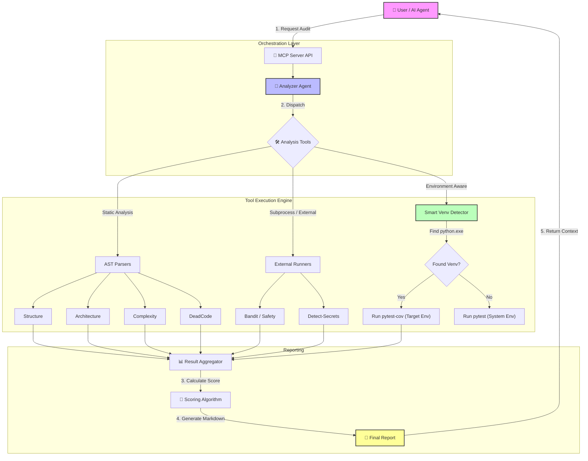

# ProjectAuditAgent

[](https://www.python.org/downloads/)
[](https://fastapi.tiangolo.com/)
[](https://opensource.org/licenses/MIT)

**Production-ready MCP (Model Context Protocol) server for comprehensive Python/FastAPI project analysis.**

ProjectAuditAgent performs deep code analysis using AST parsing, detects duplicates, dead code, efficiency issues, secrets, and generates detailed markdown reports with actionable insights.

## 🚀 Features

### **10 Extensible Analysis Tools**

1. **📁 Structure** - Directory tree visualization and file statistics
2. **🏗️ Architecture** - FastAPI/Python best practices validation via AST
3. **🎭 Duplication** - Function/method duplicate detection with fuzzy matching (excludes tests)
4. **☠️ Dead Code** - Unused functions, classes, and imports detection
5. **⚡ Efficiency** - Performance anti-patterns (nested loops, string concat) with smart filtering
6. **🧹 Cleanup** - Cache/temp files detection with grouped summaries
7. **🔒 Secrets** - Credential detection using `detect-secrets`
8. **✅ Tests** - Coverage analysis with smart venv detection and test organization
9. **📋 Gitignore** - Auto-generated gitignore recommendations
10. **📝 Git** - Recent changes tracking (`git diff --stat` and `git log -1`)

### **Plugin Architecture**
- **Dynamic tool discovery** - Drop new tools in `app/tools/` and they're auto-loaded
- **Easy extensibility** - Inherit from `BaseTool`, implement `analyze()` method
- **Enable/disable tools** - Control which tools run via API

### **Production Features**
- ✅ **Health check system** - Proactive dependency warnings on startup and in reports
- ✅ **Robust command execution** - Uses `sys.executable` pattern to prevent PATH issues
- ✅ 100% local execution (no external APIs)
- ✅ **Smart venv detection** - Searches parent directories for accurate coverage
- ✅ **Meaningful report filenames** - `audit_{project_name}_{timestamp}.md`
- ✅ **Enhanced reports** - Top 3 issues summary, prominent warnings, compact sections
- ✅ **Intelligent filtering** - Ignores valid constants, singletons, and test code
- ✅ **Optimized cleanup detection** - Prevents recursive cache directory noise
- ✅ Comprehensive scoring algorithm (0-100)
- ✅ Detailed markdown reports
- ✅ FastAPI REST API with full OpenAPI docs
- ✅ Docker support with health checks
- ✅ 60%+ test coverage (optimized for speed)
- ✅ Pydantic validation everywhere
- ✅ Production-ready error handling

## 🧠 How it Works



## 📦 Installation

### **Option 1: Local Setup**

```bash
# Clone the repository
git clone <your-repo-url>
cd project-audit

# Create virtual environment
python -m venv venv
source venv/bin/activate  # On Windows: venv\Scripts\activate

# Install dependencies
pip install -r requirements.txt

# Run the server
uvicorn app.main:app --reload
```

### **Option 2: Docker**

```bash
# Build and run with docker-compose
docker-compose up --build

# Or build manually
docker build -t project-audit .
docker run -p 8000:8000 -v ./projects:/projects:ro -v ./reports:/app/reports project-audit
```

## 🔌 Connect to Claude & Cursor

To use this tool with **Claude Desktop** or **Cursor**, please follow the detailed setup instructions in [INTEGRATION_GUIDE.md](INTEGRATION_GUIDE.md).

This guide contains:
- Complete `claude_desktop_config.json` configuration
- Cursor MCP setup steps
- Troubleshooting tips

## 🎯 Quick Start

### **✅ Prerequisites for Target Projects**

To get **accurate test coverage scores**, ensure your target project has `pytest-cov` installed in its virtual environment:

```bash
# In your project's venv
pip install pytest-cov
```

Without this, the auditor will fail to collect coverage data (timeout or exit code 1) and will fall back to basic analysis.

### **1. Start the Server**

```bash
uvicorn app.main:app --reload
```

Server runs on `http://localhost:8000`

### **2. Run an Audit**

```bash
# Audit a project
curl -X POST http://localhost:8000/audit \
  -H "Content-Type: application/json" \
  -d '{"path": "/path/to/your/project", "dry_run": false}'

# Response
{
  "report_id": "audit_myproject_20260103_172000",
  "score": 85,
  "report_path": "reports/audit_myproject_20260103_172000.md",
  "summary": "Analysis complete: 10/10 tools succeeded. Overall score: 85/100. Test coverage: 96%"
}
```

### **3. Get the Report**

```bash
curl http://localhost:8000/report/audit_myproject_20260103_172000
```

## 📚 API Endpoints

### **Core Endpoints**

| Method | Endpoint | Description |
|--------|----------|-------------|
| `GET` | `/` | API information |
| `GET` | `/health` | Health check |
| `POST` | `/audit` | Run full project audit |
| `GET` | `/report/{report_id}` | Retrieve generated report |

### **Tool Management**

| Method | Endpoint | Description |
|--------|----------|-------------|
| `GET` | `/tools` | List all available tools |
| `POST` | `/tools/{tool_name}/run` | Run specific tool |
| `POST` | `/tools/{tool_name}/enable` | Enable a tool |
| `POST` | `/tools/{tool_name}/disable` | Disable a tool |

### **Request Examples**

**Full Audit:**
```json
POST /audit
{
  "path": "/path/to/project",
  "dry_run": false,
  "tools": null  // null = all tools, or ["structure", "tests"]
}
```

**Run Specific Tool:**
```json
POST /tools/duplication/run
{
  "path": "/path/to/project"
}
```

## 📊 Sample Report

```markdown
# Project Audit: /path/to/myproject
**Date:** 2026-01-03 17:20:00 | **Score:** 85/100

---

## 🚨 Top Critical Issues

1. 🟡 **12 unused functions detected** (Dead Code)
2. 🟡 **5 code duplicates found** (Duplication)
3. 🔵 **No integration tests** (Tests)

---

## 📝 Recent Changes

**Last Commit:** a1b2c3d - John Doe, 2 hours ago : Add user authentication

**Uncommitted Changes:**
```
 app/main.py     | 15 +++++++++------
 app/auth.py     |  8 ++++++++
 2 files changed, 17 insertions(+), 6 deletions(-)
```

---

## 📁 Structure
📁 app/
├── 📁 routers/
├── 📁 models/
└── 🐍 main.py

**File Statistics:**
- `.py`: 45 files
- `.json`: 3 files

## 🏗️ Architecture: ✅ No issues

## 🎭 Code Duplicates (5)
- **format_date** (100% similar)
  - `utils/helpers.py:15`
  - `services/formatter.py:42`
  - `api/utils.py:8`

## ☠️ Dead Code (12)
**Unused Functions:**
- `helpers/old_parser.py:parse_xml()` - 0 references
- `utils/legacy.py:convert_data()` - 0 references

## ⚡ Efficiency: ✅ No issues

## 🧹 Cleanup (12.4MB)
- `__pycache__ (Found 320 files, 8.2MB)` - Recommended: Run pyclean .
- `.pytest_cache (Found 45 files, 2.1MB)` - Recommended: Remove manually

## 🔒 Secrets: ✅ No issues

## ✅ Tests: 96% coverage
**Test Types:**
- Unit: ✅
- Integration: ❌
- E2E: ❌

## 📋 Gitignore: ✅ Complete
```

## 🧪 Testing

```bash
# Run all tests with coverage
pytest

# Run specific test file
pytest tests/test_tools.py

# Run with verbose output
pytest -v

# Generate HTML coverage report
pytest --cov=app --cov-report=html
```

**Coverage requirement:** 60% minimum (configured in `pyproject.toml`)

## 🎯 Key Improvements

### **Health Check System** 🆕
Proactive dependency monitoring prevents runtime failures:
- **Server Startup Check**: Validates `radon`, `vulture`, `bandit` are installed
- **Target Project Check**: Detects missing `pytest-cov` before running coverage
- **Prominent Warnings**: GitHub-style alerts in reports with exact install commands
- **Example**: `⚠️ MISSING PREREQUISITE: 'pytest-cov' not installed. Coverage cannot be calculated.`

### **Robust Command Execution** 🆕
Uses `sys.executable -m` pattern to prevent "command not found" crashes:
- Works on Windows, Linux, and macOS regardless of PATH configuration
- Runs tools via current Python interpreter instead of shell commands
- **Fixed tools**: `radon`, `vulture`, `bandit` now execute reliably

### **Smart Venv Detection**
The tests tool automatically detects and uses your project's virtual environment:
- **Searches parent directories** - Finds venv even when auditing subdirectories
- OS-aware: Windows (`Scripts/python.exe`) vs Linux/Mac (`bin/python`)
- Verifies pytest availability before use
- Falls back to system coverage with warnings
- **Handles test failures gracefully** - Reports coverage even when tests fail (exit code 1)

### **Intelligent Filtering**
- **Efficiency Tool**: Ignores UPPERCASE constants, private variables (`_prefix`), and common singletons (generator, service, client, etc.)
- **Duplication Tool**: Automatically excludes `tests/` and `test/` directories
- **Cleanup Tool**: Groups cache directories into single summary lines instead of listing hundreds of individual `.pyc` files

### **Enhanced Reports**
- **Dependency Warnings**: Prominently displayed after score using GitHub alert boxes
- **Top 3 Critical Issues**: Summary at the top prioritized by severity
- **Compact Empty Sections**: Shows `✅ No issues` instead of taking up 5+ lines
- **Git Context**: Displays recent commits and uncommitted changes
- **Meaningful Filenames**: `audit_{project_name}_{YYYYMMDD_HHMMSS}.md`

## 🔧 Adding New Tools

Create a new tool in `app/tools/`:

```python
# app/tools/my_custom_tool.py
from pathlib import Path
from typing import Dict, Any
from app.core.base_tool import BaseTool

class MyCustomTool(BaseTool):
    """My custom analysis tool."""
    
    @property
    def description(self) -> str:
        return "Performs custom analysis on the project"
    
    def analyze(self, project_path: Path) -> Dict[str, Any]:
        """Perform analysis."""
        if not self.validate_path(project_path):
            return {"error": "Invalid path"}
        
        # Your analysis logic here
        results = {
            "findings": [],
            "total_issues": 0
        }
        
        return results
```

**That's it!** The tool will be auto-discovered on server startup.

## 📁 Project Structure

```
project-audit/
├── app/
│   ├── main.py                 # FastAPI server
│   ├── schemas.py              # Pydantic models
│   ├── agents/
│   │   └── analyzer_agent.py   # Main orchestration
│   ├── core/
│   │   ├── base_tool.py        # Base tool interface
│   │   ├── tool_registry.py    # Dynamic tool loading
│   │   └── report_generator.py # MD report builder
│   └── tools/                  # Analysis plugins
│       ├── structure_tool.py
│       ├── architecture_tool.py
│       ├── duplication_tool.py
│       ├── deadcode_tool.py
│       ├── efficiency_tool.py
│       ├── cleanup_tool.py
│       ├── secrets_tool.py
│       ├── tests_tool.py
│       ├── gitignore_tool.py
│       └── git_tool.py          # NEW: Git change tracking
├── tests/
│   ├── test_analyzer_agent.py
│   ├── test_tools.py
│   └── test_api.py
├── requirements.txt
├── Dockerfile
├── docker-compose.yml
├── pyproject.toml
└── README.md
```

## 🎯 Scoring Algorithm

The overall score (0-100) is calculated based on:

- **Architecture** (20 pts): -5 per error, -2 per warning, -1 per info
- **Tests** (20 pts): Based on coverage % + bonuses for test types
- **Dead Code** (15 pts): -1 per dead function/import (max -15)
- **Duplicates** (15 pts): -2 per duplicate (max -15)
- **Efficiency** (10 pts): -1 per issue (max -10)
- **Secrets** (10 pts): -10 if any secrets found
- **Cleanup** (5 pts): -3 to -5 based on cleanup size
- **Structure** (5 pts): Included in architecture

## 🐳 Docker Usage

```bash
# Build
docker-compose build

# Run
docker-compose up

# Run in background
docker-compose up -d

# View logs
docker-compose logs -f

# Stop
docker-compose down
```

**Volume mounts:**
- `./projects:/projects:ro` - Mount projects to analyze (read-only)
- `./reports:/app/reports` - Persist generated reports

## 🔍 Technical Details

### **AST-Based Analysis**
All code analysis uses Python's `ast` module for accurate parsing:
- Function/class extraction
- Import tracking
- Code pattern detection
- Circular import detection

### **Fuzzy Matching**
Duplicate detection uses `rapidfuzz` for similarity scoring:
- Exact duplicates: 100% match via MD5 hash
- Similar code: 80%+ similarity threshold

### **Subprocess Integration**
External tools run via subprocess:
- `detect-secrets` for secrets scanning
- `coverage` + `pytest` for test coverage
- **Smart venv detection** - Uses project's Python interpreter when available
- Timeout protection (30s for coverage, 10s for reports)

## 📝 Configuration

### **Environment Variables**

```bash
LOG_LEVEL=INFO  # Logging level (DEBUG, INFO, WARNING, ERROR)
```

### **Tool Configuration**

Tools can be enabled/disabled via API:

```bash
# Disable a tool
curl -X POST http://localhost:8000/tools/secrets/disable

# Enable a tool
curl -X POST http://localhost:8000/tools/secrets/enable
```

## 🚧 Roadmap

- [x] Security analysis (bandit integration)
- [ ] Performance profiling
- [ ] Documentation coverage
- [ ] Dependency vulnerability scanning
- [ ] Custom rule engine
- [ ] Web UI dashboard
- [ ] CI/CD integration examples

## 📄 License

MIT License - see LICENSE file for details

## 🤝 Contributing

1. Fork the repository
2. Create a feature branch
3. Add your tool in `app/tools/`
4. Write tests in `tests/`
5. Ensure coverage >85%
6. Submit a pull request

## 💡 Examples

### **Analyze Current Directory**

```python
import requests

response = requests.post(
    "http://localhost:8000/audit",
    json={"path": ".", "dry_run": False}
)

print(f"Score: {response.json()['score']}/100")
print(f"Report: {response.json()['report_path']}")
```

### **Run Only Specific Tools**

```python
response = requests.post(
    "http://localhost:8000/audit",
    json={
        "path": "/path/to/project",
        "tools": ["structure", "tests", "secrets"]
    }
)
```

### **Get Tool Information**

```python
tools = requests.get("http://localhost:8000/tools").json()
for tool in tools:
    print(f"{tool['name']}: {tool['description']}")
```

---

**Built with ❤️ using FastAPI, Pydantic, and AST magic**

For issues or questions, please open a GitHub issue.
