# ProjectAuditAgent 🕵️‍♂️

[](https://www.python.org/downloads/)
[](https://fastapi.tiangolo.com/)
[](https://modelcontextprotocol.io/)

**Production-ready Model Context Protocol (MCP) server for deep Python/FastAPI project analysis.**

ProjectAuditAgent performs AST-based code analysis to detect duplicates, dead code, efficiency issues, and security risks, generating actionable markdown reports with **realistic scores** and **comprehensive insights**.

> **🚀 NEW in v2.7:** [**Performance Optimization Suite**](docs/OPTIMIZATION_ARCHITECTURE.md) - **35-880x faster** audits with caching & Ruff!  
> **⚡ Intelligent Caching:** Instant results (0.1s) for unchanged code with smart file-based invalidation  
> **🔥 Ruff Comprehensive:** Single tool replaces 6+ linters (Bandit, pycodestyle, isort, pyflakes, McCabe, pydocstyle)  
> **📁 Smart Filtering:** Automatically excludes 50-80% of irrelevant files (node_modules, .venv, etc.)  
> Perfect for rapid iteration and CI/CD pipelines. [Architecture →](docs/OPTIMIZATION_ARCHITECTURE.md)

> **🎯 NEW in v2.8:** [**Incremental Audit System**](docs/INCREMENTAL_AUDIT_GUIDE.md) - **90%+ faster** audits by analyzing only changed files!  
> **🔄 Smart Change Detection:** MD5-based file tracking detects new, modified, and deleted files  
> **💾 Per-Tool Caching:** Merges cached results with new analysis for accurate reports  
> **⚡ Massive Time Savings:** 60s → 5s on subsequent runs (analyze 3 files instead of 100!)  
> **📊 Performance Feedback:** Clear metrics showing exactly how much time you saved  
> Perfect for development workflows and CI/CD optimization. [Guide →](docs/INCREMENTAL_AUDIT_GUIDE.md)

> **🆕 NEW in v2.5:** [**Safety-First Engine**](docs/SAFETY_FIRST_IMPLEMENTATION.md) - Robust, crash-proof auditing for large projects!  
> **🆕 NEW in v2.3:** [**PR Gatekeeper**](docs/PR_GATEKEEPER_GUIDE.md) - Lightning-fast delta-based auditing for Pull Requests!  
> Scans ONLY changed files (3-5x faster), runs tests as safety net, returns explicit recommendations.  
> Perfect for CI/CD pipelines. [Quick Start →](docs/PR_GATEKEEPER_QUICK_REF.md)

---

## 🚀 Features

### **14 Extensible Analysis Tools**
| Tool | Description |
|------|-------------|
| **📁 Structure** | Directory tree visualization and file statistics |
| **🏗️ Architecture** | Mermaid dependency graphs with subgraph grouping |
| **🎭 Duplication** | 6-line block hashing to detect code duplication |
| **☠️ Dead Code** | Unused functions, classes, and imports (Vulture) |
| **⚡ Efficiency** | Cyclomatic complexity analysis (Radon) |
| **🧹 Cleanup** | Cache/temp files detection with size tracking |
| **🔒 Bandit** | Security vulnerability scanning |
| **🔑 Secrets** | Credential detection using `detect-secrets` |
| **📋 Ruff** | Fast Python linter for code quality |
| **🔍 Pip-Audit** | Dependency vulnerability checking |
| **✅ Tests** | Coverage analysis with Unit/Integration/E2E breakdown |
| **📝 Git** | Recent changes, commit tracking & branch status |
| **🚦 PR Gatekeeper** | Delta-based audit of ONLY changed files with test safety net |
| **🌐 Remote Audit** | Audit any public Git repo without manual cloning |


### **Production Capabilities**
* **⚡ Intelligent Caching System:** 35-880x speedup with MD5-based file change detection and 1-hour cache expiration
* **🔥 Ruff Comprehensive Linting:** Single command replaces 6+ tools (Bandit, pycodestyle, isort, pyflakes, McCabe, pydocstyle)
* **📁 Smart File Filtering:** Automatically excludes 50-80% of irrelevant files (node_modules, .venv, dist, build, etc.)
* **🌐 Remote Repository Auditing:** Audit any public Git repo without cloning - perfect for dependency security checks
* **🚦 PR Gatekeeper:** Delta-based auditing - scans ONLY changed files (3-5x faster than full audit)
* **✨ Agentic Dependency Installation:** AI automatically detects missing tools and asks user permission to install
* **📊 Realistic Scoring Algorithm:** Exponential penalties for low coverage (9% = -40 points, not -10!)  
* **📋 Tool Execution Summary:** Comprehensive table showing status of all 14 tools at a glance
* **🧪 Test Type Detection:** Automatically categorizes tests as Unit, Integration, or E2E
* **🔄 Recent Changes Tracking:** Shows last commit, author, time, and uncommitted changes
* **⏱️ Timeout Protection:** All subprocess calls protected with timeouts to prevent hangs
* **🎯 Smart Filtering:** Automatically excludes `.venv`, `node_modules`, and build artifacts
* **🔗 Pako Compression:** Mermaid graphs compressed for reliable link generation
* **🛡️ Auto-Fix with Safety:** Git dirty check prevents mixing uncommitted changes
* **🔒 100% Local:** No code leaves your machine

---

## 🧠 Architecture Flow

```mermaid
graph TD
    User["👤 User / AI Agent"] -->|1. Request Audit| API["📡 MCP Server API"]
    
    subgraph "Orchestration Layer"
        API --> Agent["🤖 Analyzer Agent"]
        Agent -->|2. Dispatch| Tools
    end
    
    subgraph "Tool Execution Engine"
        direction TB
        Tools{"🛠️ Analysis Tools"}
        
        Tools -->|Static Analysis| AST["AST Parsers"]
        AST --> Structure & Architecture
        AST --> Complexity & DeadCode
        
        Tools -->|Subprocess| Ext["External Runners"]
        Ext --> Security["Bandit"]
        Ext --> Secrets["Detect-Secrets"]
        Ext --> Ruff["Ruff Linter"]
        
        Tools -->|Environment Aware| Env["Smart Venv Detector"]
        Env -->|Find python| Venv{"Found Venv?"}
        Venv -->|Yes| PyTest["Run pytest-cov (Target Env)"]
        Venv -->|No| SysTest["Run pytest (System Env)"]
    end
    
    subgraph "Reporting"
        Structure & Architecture & Complexity & DeadCode --> Agg["📊 Result Aggregator"]
        Agg -->|3. Score| Score["💯 Scoring Algorithm"]
        Score -->|4. Generate Markdown| MD["📝 Final Report"]
    end
    
    MD -->|5. Return Context| User
    
    style User fill:#f9f,stroke:#333,stroke-width:2px
    style Agent fill:#bbf,stroke:#333,stroke-width:2px
    style MD fill:#ff9,stroke:#333,stroke-width:2px
```



---

## 📦 Installation & Setup

### 1. Environment Setup
```bash
# Clone and enter repo
git clone https://github.com/Amitro123/mcp-python-auditor.git
cd mcp-python-auditor

# Create venv
python -m venv .venv
source .venv/bin/activate  # Windows: .venv\Scripts\activate

# Install dependencies
pip install -r requirements.txt
```

### 2. Install Analysis Tools
```bash
# Required for full functionality
pip install bandit detect-secrets vulture radon ruff pip-audit pytest pytest-cov

# Or let the AI install them for you! (Agentic flow)
# Just run the server and it will detect missing tools automatically
```

### 3. Verify Installation
```bash
# Run the verification script
python verify_tools.py

# Should show: ✅ All tools are properly installed!
```

### 4. Run the MCP Server
You have two entry points depending on your needs:

**Option A: FastMCP (Recommended for Claude Desktop/Cursor)**
```bash
python mcp_fastmcp_server.py
# Or with fastmcp CLI:
fastmcp dev mcp_fastmcp_server.py
```

**Option B: FastAPI Server (For API usage)**
```bash
uvicorn app.main:app --reload
```

---

## 🔌 MCP Configuration (Claude/Cursor)

To use this tool with Claude Desktop or Cursor, add the following to your config file:

**File:** `claude_desktop_config.json`  
**Location:**
- **Mac:** `~/Library/Application Support/Claude/`
- **Windows:** `%APPDATA%\Claude\`

```json
{
  "mcpServers": {
    "project-audit": {
      "command": "python",
      "args": ["C:\\absolute\\path\\to\\mcp-python-auditor\\mcp_fastmcp_server.py"]
    }
  }
}
```

> **Note:** Use absolute paths and double backslashes (`\\`) on Windows.

**📖 For detailed MCP setup guide, see:** [docs/MCP_USER_GUIDE.md](docs/MCP_USER_GUIDE.md)

---

## 🎯 Usage Examples

Once connected to Claude, you can use natural language to trigger tools.

### 1. Full Audit
```
"Run a full audit on C:/Projects/MyApp and generate a report."
```

**What it does:**
- Runs all 13 analysis tools in parallel
- Generates a scored report (0-100)
- Saves to `reports/FULL_AUDIT_<id>.md`
- Returns markdown content to AI

### 2. PR Gatekeeper (Fast Delta Audit)
```
"Run PR audit on C:/Projects/MyApp comparing to main branch."
```

**What it does:**
1. 🔍 Detects changed Python files vs base branch
2. ⚡ Runs Bandit, Ruff, Radon ONLY on changed files (fast!)
3. 📊 Calculates quality score based on findings
4. ✅ Runs pytest as safety net (if score > 80)
5. 🎯 Returns explicit recommendation:
   - 🟢 "Ready for Review" (high score + tests pass)
   - 🔴 "Request Changes" (security issues or tests fail)
   - 🟡 "Needs Improvement" (low score)

**Use case:** Perfect for CI/CD pipelines and PR reviews!

### 3. Missing Dependencies? No Problem!
```
AI: "I need to run an audit but tools are missing. Would you like me to install them?"
You: "Yes, install them"
AI: [Calls install_dependencies tool]
AI: "✅ Installation successful! Running audit now..."
```

### 4. Architecture Review
```
"Analyze the project architecture and show me the dependency graph."
```

**What it does:**
- Parses Python imports using AST
- Groups modules into subgraphs by directory
- Generates Mermaid diagram with compressed link

### 5. Auto-Fix (Safe Code Cleanup)
```
"Run auto-fix with confirm=True."
```

**What it does:**
1. ✅ Checks for uncommitted changes (aborts if dirty)
2. 📦 Creates backup zip
3. 🗑️ Deletes cache directories
4. 🎨 Runs `ruff check --fix` and `ruff format`
5. 📝 Writes `FIX_LOG.md`
6. 🌿 Creates new branch and commits

### 6. Remote Repository Auditing
```
"Audit the requests library from GitHub"
"Check security of https://github.com/psf/requests.git"
```

**What it does:**
1. 🌐 Clones repo to temporary directory (shallow clone for speed)
2. 🔍 Runs all 14 analysis tools
3. 📊 Generates comprehensive audit report
4. 🧹 Automatically cleans up temp files
5. 📈 Returns score + findings summary

**Use case:** Quick security assessment of dependencies before adding them!

---

## 📊 Scoring Algorithm

The score (0-100) uses **strict, realistic weights** to avoid false positives:

| Category | Max Penalty | How It's Calculated |
|----------|-------------|---------------------|
| **Security** | -70 points | Bandit issues (×5, cap 30) + Secrets found (×10, cap 40) |
| **Testing** | -50 points | 0%=-50, <10%=-40, <30%=-30, <50%=-20, <70%=-10 |
| **Quality** | -35 points | Dead code (×2, cap 20) + Duplicates >95% similarity (excess over 10, cap 15) |

### Coverage Penalty Tiers

| Coverage | Penalty | Assessment |
|----------|---------|------------|
| 0% | -50 | ❌ Critical - No tests |
| 1-9% | -40 | 🔴 Critical |
| 10-29% | -30 | 🔴 Very Low |
| 30-49% | -20 | 🟠 Low |
| 50-69% | -10 | 🟡 Moderate |
| 70%+ | 0 | 🟢 Good |

### Score Grades

| Score | Grade | Assessment |
|-------|-------|------------|
| 95-100 | A+ | 🏆 Excellent |
| 90-94 | A | 🟢 Great |
| 80-89 | B | 🟢 Good |
| 70-79 | C | 🟡 Acceptable |
| 60-69 | D | 🟠 Needs Work |
| 0-59 | F | 🔴 Needs Improvement |

---

## 📝 Report Features

Every generated report includes:

### 1. **Tool Execution Summary**
A comprehensive table showing the status of all 12 analysis tools:

| Tool | Status | Details |
|------|--------|----------|
| 📁 Structure | ✅ Pass | 140 files, 15 dirs |
| 🔒 Security | ❌ Fail | 3 issues |
| ✅ Tests | ⚠️ Error | Coverage: 9% |
| 🎭 Duplication | ❌ Fail | 78 duplicate blocks |

### 2. **Test Type Breakdown**
Automatically categorizes tests for better insight:

```markdown
**Test Types:**
- Unit: ✅ (15 files)
- Integration: ❌ (0 files)  
- E2E: ❌ (0 files)

👉 **Recommendation:** Add integration tests to verify component interactions
```

### 3. **Recent Changes**
Shows last commit with full context:

```markdown
**Last Commit:** `3884c80` - Amit, 2 hours ago
*"feat: Reformat Git Status as Recent Changes section"*

**Status:** ⚠️ 3 uncommitted change(s)
**Branch:** `main`
```

### 4. **Interactive Architecture Graph**
Clickable Mermaid.Live link with:
- Subgraph grouping by directory
- Color-coded dependencies
- Pako compression for long graphs

---

## 📁 Project Structure

```
mcp-python-auditor/
├── app/                  # Application source code (if using FastAPI mode)
│   ├── agents/          # Analyzer orchestration
│   ├── core/            # Base classes, config
│   └── tools/           # 12 analysis tool implementations
├── docs/                # Documentation
│   ├── MCP_USER_GUIDE.md           # Setup guide for Claude/Cursor
│   ├── IMPLEMENTATION_SUMMARY.md   # Technical details
│   ├── AUTOFIX_GUIDE.md            # Auto-fix workflow
│   └── SESSION_SUMMARY.md          # Development history
├── backups/             # Backup files and logs
├── reports/             # Generated audit reports
├── tests/               # Test suite
├── data/                # Training datasets
├── .gitignore
├── docker-compose.yml
├── Dockerfile
├── mcp_fastmcp_server.py   # ⭐ Main MCP entry point
├── verify_tools.py          # Tool verification script
├── pyproject.toml
├── README.md
└── requirements.txt
```

---

## 🛠️ Development

### Running Tests
```bash
pytest tests/ -v --cov=app
```

### Verifying Tools
```bash
python verify_tools.py
```

Output:
```
🔍 Verifying Audit Tools Installation
==================================================
✅ bandit               - Security scanning
✅ detect-secrets       - Secret detection
✅ vulture              - Dead code detection
...
🎉 All tools are properly installed!
```

### Adding a New Tool
1. Create `app/tools/your_tool.py` inheriting from `BaseTool`
2. Implement `analyze(project_path: Path) -> dict`
3. Register in `app/core/tool_registry.py`
4. Add to parallel execution in `mcp_fastmcp_server.py`

### Docker Setup
```bash
docker-compose up --build
```

---

## 📚 Documentation

| Document | Description |
|----------|-------------|
| [MCP User Guide](docs/MCP_USER_GUIDE.md) | How to configure and use with AI assistants |
| [Remote Audit Guide](docs/REMOTE_AUDIT_GUIDE.md) | **NEW!** Audit any Git repo without manual cloning |
| [PR Gatekeeper Guide](docs/PR_GATEKEEPER_GUIDE.md) | **NEW!** Complete guide for delta-based PR auditing |
| [PR Gatekeeper Quick Ref](docs/PR_GATEKEEPER_QUICK_REF.md) | **NEW!** Quick reference with common scenarios |
| [Implementation Summary](docs/IMPLEMENTATION_SUMMARY.md) | Technical architecture details |
| [Auto-Fix Guide](docs/AUTOFIX_GUIDE.md) | Safe code cleanup workflow |
| [Session Summary](docs/SESSION_SUMMARY.md) | Development history |

---

## 🐛 Troubleshooting

### "Tool not found" in Claude
- **Fix:** Restart Claude Desktop
- **Check:** Look at logs in `%APPDATA%\Claude\logs\`

### "Missing tool: bandit"
- **Fix Option 1:** Let AI install them (agentic flow)
  ```
  User: "Run audit"
  AI: "Tools missing. Install them?"
  User: "Yes"
  ```
- **Fix Option 2:** Manual install
  ```bash
  pip install bandit detect-secrets vulture radon ruff pip-audit
  ```
- **Verify:** `python verify_tools.py`

### False Scores (e.g., 90/100 with 9% coverage)
- **Cause:** Using old version before scoring fix
- **Fix:** Pull latest code: `git pull origin main`
- **New behavior:** Realistic scores (45/100 for that project)

### Timeout errors
- **Cause:** Large codebases or slow disk I/O
- **Fix:** Tools have built-in timeouts (60s-300s) and will gracefully fail

---

## ⚡ Performance Optimization (NEW!)

ProjectAuditAgent v2.7 introduces a comprehensive optimization suite that delivers **35-880x speedup**:

### 1. **Intelligent Caching System**
```python
# First run: Full analysis
start_full_audit(path="/project")  # 54.2s

# Second run: Cached results
start_full_audit(path="/project")  # 0.1s (542x faster!)
```

**Features:**
- ✅ MD5-based file change detection
- ✅ 1-hour cache expiration (configurable)
- ✅ Per-tool caching with smart invalidation
- ✅ Automatic `.audit_cache/` management
- ✅ Cache statistics via MCP tool

**Cache Storage:**
```
project/
├── .audit_cache/
│   ├── bandit_cache.json
│   ├── ruff_cache.json
│   ├── tests_cache.json
│   └── ... (one per tool)
```

### 2. **Ruff Comprehensive Linting**
Single command replaces **6+ separate tools**:

| Before | After | Speedup |
|--------|-------|---------|
| Bandit (18s) + pycodestyle (12s) + isort (6s) + pyflakes (6s) + McCabe (4s) + pydocstyle (7s) = **54s** | Ruff Comprehensive = **1.2s** | **45x faster** |

**Rule Coverage:**
- `S` - Security (Bandit replacement)
- `E, W` - Style (pycodestyle)
- `I` - Imports (isort)
- `F` - Errors (pyflakes)
- `C90` - Complexity (McCabe)
- `D` - Docstrings (pydocstyle)
- `PERF, B` - Performance & bugs
- `UP, SIM, RUF` - Upgrades & simplifications

**Categorized Results:**
```json
{
  "categorized": {
    "security": [...],
    "quality": [...],
    "imports": [...],
    "complexity": [...],
    "performance": [...]
  }
}
```

### 3. **Smart File Filtering**
Automatically excludes **50-80% of irrelevant files**:

**Universal Excludes:**
- `node_modules`, `.venv`, `venv`, `env`
- `dist`, `build`, `__pycache__`
- `frontend`, `static`, `public`
- `.git`, `.pytest_cache`, `.mypy_cache`
- `.audit_cache` (our own cache)

**Tool-Specific Filtering:**
```python
from app.core.file_filter import FileFilter

ff = FileFilter(Path("."))

# Bandit: Production code only (excludes tests)
bandit_files = ff.get_filtered_files("bandit")  # 42 files

# Ruff: All Python files
ruff_files = ff.get_filtered_files("ruff")  # 58 files

# Tests: Only test files
test_files = ff.get_filtered_files("tests")  # 16 files
```

### 4. **Performance Metrics**

**Before Optimization:**
```
Bandit:        18.3s  ████████████████████
pycodestyle:   12.5s  █████████████
isort:          6.2s  ██████
pyflakes:       5.8s  ██████
McCabe:         4.1s  ████
pydocstyle:     7.3s  ███████
─────────────────────────────────────
TOTAL:         54.2s  ██████████████████████████████████
```

**After Optimization (First Run):**
```
File Filter:    0.01s  ▌
Ruff Comp:      1.23s  █
─────────────────────────────────────
TOTAL:          1.24s  █

SPEEDUP: 43.7x faster! 🚀
```

**After Optimization (Cached):**
```
Ruff (cached):  0.10s  ▌
─────────────────────────────────────
TOTAL:          0.10s  ▌

SPEEDUP: 542x faster! 🚀🚀🚀
```

### 5. **MCP Tools for Cache Management**

```python
# Get cache statistics
get_cache_stats(path="/project")

# Clear specific tool cache
clear_audit_cache(path="/project", tool_name="bandit")

# Clear all caches
clear_audit_cache(path="/project")

# Run comprehensive Ruff check
run_ruff_comprehensive_check(path="/project")
```

**📚 Complete Documentation:**
- [Optimization Architecture](docs/OPTIMIZATION_ARCHITECTURE.md)
- [Caching System](docs/CACHING_SYSTEM.md)
- [Ruff Comprehensive](docs/RUFF_COMPREHENSIVE_OPTIMIZATION.md)

---

## 🎉 Recent Improvements

**v2.7 - Performance Optimization Suite (Jan 2026)**
- ✅ **Intelligent Caching**: 35-880x speedup with MD5-based file change detection
- ✅ **Ruff Comprehensive**: Single tool replaces 6+ linters (45x faster)
- ✅ **Smart File Filtering**: Excludes 50-80% of irrelevant files automatically
- ✅ **FileFilter Class**: Dedicated file filtering system with tool-specific configurations
- ✅ **Cache Manager**: Production-ready caching with auto-gitignore and statistics
- ✅ **MCP Tools**: Cache management and comprehensive linting via MCP
- 📚 See: `docs/OPTIMIZATION_ARCHITECTURE.md` for complete architecture

**v2.5 - Safety-First Update (Jan 2026)**
- ✅ **Safety-First Engine**: Replaced recursive scanning with Git-native discovery
- ✅ **Windows Support**: Checkpoints long command lines to prevent `WinError 206`
- ✅ **Guard Clauses**: Strict protection against scanning empty lists or excluded paths
- ✅ **Zero Noise**: 100% elimination of `.venv` and `site-packages` leaks
- ✅ **Accurate Counts**: Reports now show exact number of source files scanned

**v2.6 - Robust Engine Upgrade (Jan 2026)**
- ✅ **Remote Audit Stability**: Fixed `subprocess` compatibility and path handling for clones
- ✅ **Report Generation Protection**: Prevents crashes with fallback mechanisms for missing data
- ✅ **Path Safety**: Enhanced encoding handling for deep directory structures
- ✅ **Test Reliability**: Fixes for E2E workflows and remote assertions

**v2.4 - Remote Repository Auditing (Jan 14, 2026)**
- ✅ **NEW: Remote Audit tool** - Audit any public Git repo without manual cloning
- ✅ **Zero Setup** - Automatic temp directory management and cleanup
- ✅ **Dependency Security** - Quick security assessment before adding libraries
- ✅ **Shallow Clone** - Fast audits with `--depth 1` optimization
- ✅ **Comprehensive Error Handling** - Helpful messages for common issues
- 📚 See: `docs/REMOTE_AUDIT_GUIDE.md` for complete documentation

**v2.3 - PR Gatekeeper (Jan 14, 2026)**
- ✅ **NEW: PR Gatekeeper tool** - Delta-based auditing for Pull Requests
- ✅ **3-5x Faster audits** - Scans only changed files vs entire codebase
- ✅ **Test Safety Net** - Runs pytest to catch logic regressions
- ✅ **Explicit Recommendations** - 🟢 Ready / 🔴 Request Changes / 🟡 Needs Improvement
- ✅ **CI/CD Ready** - Perfect for GitHub Actions, GitLab CI pipelines
- ✅ **Comprehensive Docs** - Full guide, quick reference, and examples
- 📚 See: `docs/PR_GATEKEEPER_GUIDE.md` for complete documentation

**v2.2 - Major Quality Update (Jan 2026)**
- ✅ Fixed scoring algorithm (now realistic, not inflated)
- ✅ Added agentic dependency installation
- ✅ Tool execution summary in reports
- ✅ Test type breakdown (Unit/Integration/E2E)
- ✅ Recent changes section with last commit
- ✅ Comprehensive tool verification script

---

## 🤝 Contributing

Contributions welcome! Please:
1. Fork the repository
2. Create a feature branch
3. Add tests for new tools
4. Run `python verify_tools.py` before committing
5. Submit a PR with clear description

---

## 📄 License

MIT License - See [LICENSE](LICENSE) for details

---

## 🙏 Acknowledgments

- Built with [FastMCP](https://github.com/jlowin/fastmcp) by Marvin/Prefect
- AST parsing inspired by [Bandit](https://github.com/PyCQA/bandit)
- Report structure based on industry code review standards
- Scoring algorithm designed for honest project assessment

---

**Made with ❤️ for clean, secure Python codebases**

*No more false positives. No more silent failures. Just honest, actionable insights.*
